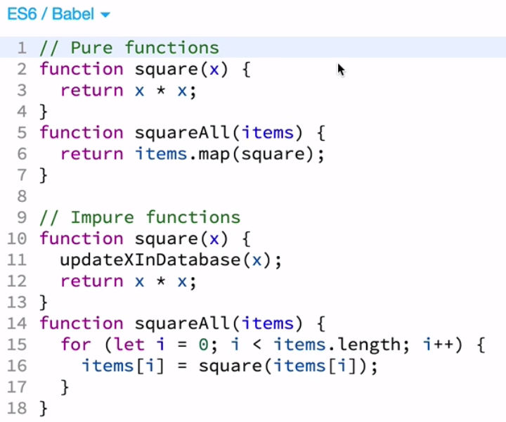

## redux几个实例

### 《一》、《counter-base》redux最简单的例子
ES6代码查看counter_es6.js，在线源码地址：https://jsbin.com/niliqeg/edit?html,js,output.
index.html中的javascript部分是counter_es6.js转译后代码.

【知识点】
* 1、唯一的store = createStore(counterReducer);
* 2、修改state唯一途径：store.dispatch(action);(作用相当于调用counterReducer)
* 3、订阅事件，store.subscribe(renderFunc);state每次改变后都会触发renderFunc函数

* 4、**理解createStore**
```javascript
// 简写createStore源码
const createStore = (reducer) => {
  let state;
  let listeners = [];

  const getState = () => state;

  const dispatch = (action) => {
    state = reducer(state, action);
    listeners.forEach(listener => listener());//执行每一个监听函数
  };

  const subscribe = (listener) => {
    listeners.push(listener);
    // for unSubscribe取消订阅
    return () => {
      listeners = listeners.filter(l => l != listener);
    }
  }
  // 初始化state
  dispatch({});

  return {getState, dispatch, subscribe};
}
```
在线源码地址：https://jsbin.com/tutumeguto/edit?js,console,output

### 《二》、《react-redux-counter》react+redux简单的例子
ES6代码查看counter_es6.js，在线源码地址：https://jsbin.com/jerebo/105/edit?html,js,output.
index.html中的javascript部分是counter_es6.js转译后代码.

【知识点】
* 1、stateless component无状态组件
* 2、react＋redux

* **3、正确更新state**.
  * 1、在组件改变state状态时，我们用的时setState()方法而不是this.state.xxx = yyy;来重新更新state状态
  * 2、state状态更新不能涉及到改变原来的state.
  比如之前曾碰到this.setState({myState: this.state.myState.concat(1)});.
  而不是this.setState({myState: this.state.myState.push(1)}); .
  > 因为push/splice会改变原数据，而concat会拷贝一份后，在新数据上操作，即不会改变原数据.

* a、给数组添加数据1.
```javascript
// old way
this.setState({myState: this.state.myState.concat(1)});
// ES6 way
[...myState, 1];
```
* b、删除数组中某个index的数据(下标从0开始).
```javascript
const removeCounter = (list, index) => {
  // Old way:
  //return list
  //  .slice(0, index)
  //  .concat(list.slice(index + 1));

  // ES6 way:
  return [
    ...list.slice(0, index),
    ...list.slice(index + 1)
  ];
};
```
* c、操作数组中某个index元素 + 1
```javascript
const incrementCounter = (list, index) => {
  // Old way:
  // return list
  //  .slice(0, index)
  //  .concat([list[index] + 1])
  //  .concat(list.slice(index + 1));

  // ES6 way:
  return [
    ...list.slice(0, index),
    list[index] + 1,
    ...list.slice(index + 1)
  ];
};
```
* **d、更新object对象, 使用Object.assign() 和 ...spread** .
```javascript
// ES6's Object.assign()
const toggleFunc = (objC) => {
  return Object.assign({}, objC, {completed: !objC.completed});
};

//  the spread operator proposed for ES7
const toggleFuncc = (objD) => {
  return {...objD, completed: !objD.completed};
};
```
* e、新增一个object对象 .
```javascript
const addFunc = (obj) => {
  return {id: obj.id, completed: false};
};
```

### 《三》、《simplest-redux-example》
react-redux完整版最简单入门实例

### 《四》、《todos》
redux完整版实例

【知识点】
* 1、**理解combineReducers**
* 2、**理解Provider**

* **

## 【总结】理解redux

* the single immutable state tree
* describing state changes with actions
* the reducer functions
* **3 important methods in store**: getState(), dispatch(), and subscribe()

### 《一》、理解store
在redux中一个应用只有唯一的object类型store保持着整个应用的state .
应用(application)中任意容器组件(container components)都可以直接访问store .
* **3 important methods in store**: getState(), dispatch(), and subscribe()
  * getState() 获取application中Redux store的当前state
  * dispatch() 使用时,dispatch actions去改变application中state
  * subscribe() 注册一个callback, 当action被dispatch后会触发该callback

### 《二》、理解action

作用：action装载着应用的数据信息(类型+数据)，通过dispatch到reducer返回新的state，同步到store的树结构中，通知组件进行更新 .
Dispatching an action is like sending a message to the store saying that something happened and that the store should update itself in response.
```javascript
//action creators
export const addTodo = (item) => {
  return {
    type: 'ADD_TODO',
    id: nextTodoId++,
    item
  }
}
```

### 《三》、理解reducer
reducer函数作用就是根据原state和dispatch的一个action来计算出新的state，类似Array中的reduce.
根据previous state ==更新==> next state.

reducer是纯函数(pure functions)【pure(return返回只和入参有关 & 不改变入参); /impure functions】.

.

**理解combineReducers**
* 1、redux中的combineReducers最终写法：.
```javascript
import { combineReducers } from 'redux'
const todoApp = combineReducers({
  todos,
  visibilityFilter
})
```
* 2、reducer中combineReducers精简源码分析 .
```javascript
const combineReducers = (reducers) => {
  return (state = {}, action) => {
    return Object.keys(reducers).reduce((nextState, key) => {
      nextState[key] = reducers[key](
        state[key],
        action
      );
      return nextState;
    }, {});
  };
};
```

### 《四》、理解redux之其他
#### 一、ES6语法相关 .
a、父组件传递props属性之... .
```javascript
<TodoApp todos={store.getState().todos}
	visibilityFilter={store.getState().visibilityFilter}/>
//可写成
<TodoApp {...store.getState()} />
```
b、{}的使用 .
```javascript
const {todos, visibilityFilter} = this.props;
//相当于
const todos = this.props.todos;
const visibilityFilter = this.props.visibilityFilter;
```
#### 二、React bindings	for	Redux
“react-redux”库提供两个如下方法使得更容易、更直接连接react组件和Redux store
1a、传递store原老方法：
* passing the store down explicitly via props(显式)
* passing the store down implicitly via props(隐式)
1b、传递store新方法
* passing the store down with <Provider> from react redux

2a、连接react和redux新方法
* generating containers with connect() from react redux

##### 1、Provider
用Provider组件包裹的应用，使得每个由connect创建的容器组件对接上同一个store.
```javascript
//Provider精简源码（渲染子组件，传递子context）
class Provider extends Component {
  getChildContext() {
    return {
      store: this.props.store
    };
  }
  render() {
    return this.props.children;
  }
};
Provider.childContextTypes = {
  store: React.PropTypes.object
};
```
##### 2、connect
用connect方法将mapping对应store树结构中state和dispatch的calls到子组件的props.
a、mapStateToProps：该函数返回值是从store中的取出需要的部分state，然后通过props传递给组件，即将store合并(map)到props中.
b、mapDispatchToProps：容器组件往下传递回调的callback，callback函数将触发执行完dispatch调度actions。所以该函数中需写各种方法(methods)合并(map)到props中往下传递

当不需要从父组件传递props可以见简写如下：.
```javascript
//== 1、原始写法
AddTodo = connect(
  state => {
    return {}
  }, dispatch => {
    return { dispatch }
  })(AddTodo);
// == 11、简单方法，即state的default值是{}，dispatch的default的值是{dispatch}
// AddTodo = connect(null, null)(AddTodo);
// == 111、最终写法
AddTodo = connect()(AddTodo);
```
#### 三、Applying	a	Middleware中间件
```javascript
//bankStore.js
import { createStore, applyMiddleware } from 'redux'
import bankReducer from './bankReducer';

const logger = (store) => (next) => (action) => {
  console.log('dispatching:', action);
  return next(action);
}
const bankStore = createStore(
  bankReducer,
  applyMiddleware(logger) // enhance the store with the logger middleware
);
export default bankStore;
```

## 参考链接
[getting started with redux](https://egghead.io/courses/getting-started-with-redux).

[1、egghead.io_redux_course_notes](https://github.com/tayiorbeii/egghead.io_redux_course_notes).

[2、egghead.io_idiomatic_redux_course_notes](https://github.com/tayiorbeii/egghead.io_idiomatic_redux_course_notes).
